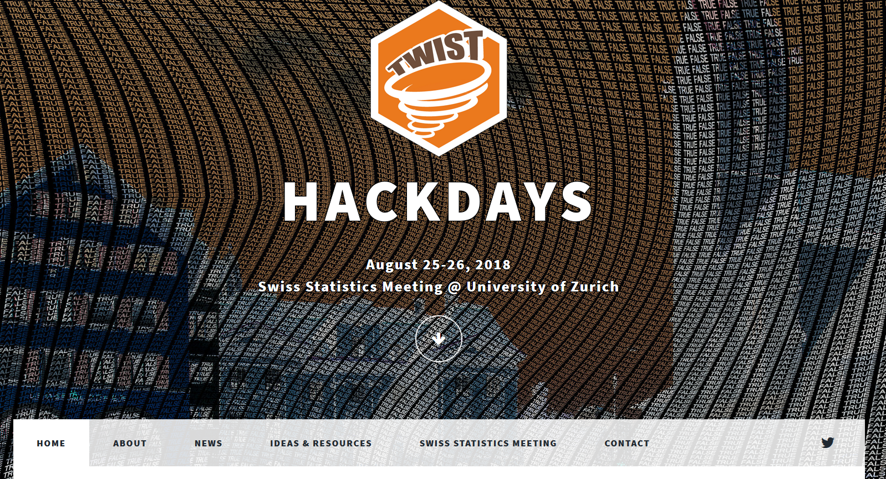

# Hugo Theme Twist

This repository contains the [Hugo](https://gohugo.io/)-Theme created for the TWIST-Hackdays, it is an adapted version of the [massively theme](https://github.com/curttimson/hugo-theme-massively) for events.

The easiest way to get started is to create a new (empty) RStudio project, then

```r
devtools::install_github('rstudio/blogdown')  # install blogdown
blogdown::new_site(theme = 'openZH/hugo-theme-twist-massively')
```

Then you should be able to see an example website launched in the RStudio Viewer.

For the full documentation, please see this section in the **blogdown** book: https://bookdown.org/yihui/blogdown/themes.html

## Features

- Blog
- Responsive
- Disqus
- Google Analytics
- Google web fonts (Merriweather and Lato)
- MathJax
- highlight.js
- Location map (via MapBox)

## Changes

The main changes I made to the original massively-theme are:

1. Introduced the possiblity of generating the navigation menu with config.toml. 

2. Changes to the css & templates --> introduced a logo-container on the main page. 

3. Customizable location map added (inspired by: [open-network-infrastructure/hugo-hackatheme](https://github.com/open-network-infrastructure/hugo-hackatheme)




## Original Theme Credits

The massively-theme has been improved significantly since it was first forked for the creation of the Twist-Website (mutliglingual support introduced and much more):

 - [Massively by HTML5 UP](https://html5up.net/massively)

 ## License

This hugo theme is licensed under the [Creative Commons Attribution 3.0 License](https://creativecommons.org/licenses/by/3.0/). 

Read More - [LICENSE](LICENSE)
